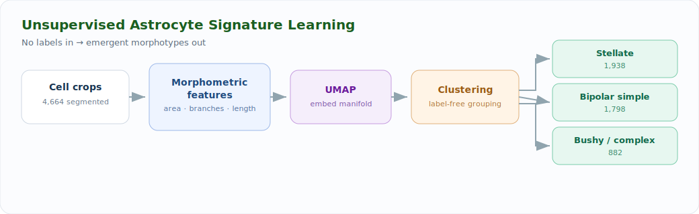

# Unsupervised Signature Learning & Clustering of Astrocytes

  
  
  
  

> Built at the **Sudha Gopalakrishnan Brain Centre, IIT Madras**. Documents method + results; source held under institutional IP.

---

## The problem

Astrocytes come in distinct morphological types, but there are **no ground-truth labels** at scale — annotating cell morphotypes by hand across thousands of cells is slow, subjective, and doesn't transfer between brains. The question: can morphotypes *emerge* directly from the data, without supervision?

## The approach

A morphometric feature pipeline feeding an unsupervised embedding and clustering stage.

1. **Cell crops** are taken from the detection/segmentation stage ([sibling project](../astrocyte-detection-segmentation)).
2. **Morphometric feature vector** — each cell is described by interpretable shape descriptors: soma area, branch count, total process length, branching complexity, convex-hull ratios, symmetry.
3. **Embedding** — features are projected to a low-dimensional manifold (UMAP) to expose structure.
4. **Unsupervised clustering** groups cells into morphotypes with no labels supplied.
5. **Interpretation** — clusters are mapped back to recognizable biological types and validated against expert intuition.

## Key results

The pipeline recovered three coherent astrocyte morphotypes from **4,664 cells**, with a clean split *(final numbers to confirm)*:

| Morphotype | Count | Character |
|---|---:|---|
| Stellate | 1,938 | star-shaped, many fine processes |
| Bipolar (simple) | 1,798 | elongated, two dominant processes |
| Bushy / complex | 882 | dense, highly branched |

> _Add your UMAP scatter colored by cluster + representative cell montages here._
>
> ``

## Tech stack

`scikit-image` · `NumPy / pandas` · `UMAP` · `scikit-learn` · `matplotlib`

## Why it matters

Label-free morphotype discovery means the method scales to **new brains and new datasets** without re-annotation, and the interpretable feature basis keeps results biologically meaningful — not a black box. This is the representation-learning half of the astrocyte program.

---

Code is private under IIT Madras / SGBC institutional agreements. Walkthrough available on request.
